<a href="https://azevedothamirest.github.io">
  
</a>

<p align="center">
  <a href="https://azevedothamirest.github.io"></a>
  <a href="https://www.linkedin.com/in/qathamiresazevedo"></a>
  <a href="https://www.instagram.com/qa.thami/"></a>
  <a href="mailto:azevedothamirest@gmail.com"></a>
</p>

###  Oi, eu sou a Thamires

QA Sênior com **7 anos em qualidade de software**, os últimos 5 em **produtos financeiros**. Atuo da análise de requisitos ao acompanhamento pós-deploy, com **testes manuais e automatizados** lado a lado:

-  **Manual** — casos funcionais, exploratórios, de regressão e UAT, investigação de ponta a ponta e bugs com evidência e severidade pelo impacto real.
-  **Automação** — **Cypress** e **Playwright** com JavaScript, testes de **API** com Postman, **testes de contrato**, fluxos assíncronos com **mensageria**, suíte integrada ao **CI/CD** e cenários em **BDD/Gherkin**.

Combino técnica com negócio — tenho **CTFL (ISTQB)** e **ANBIMA CPA** — para validar o comportamento contra a regra de negócio, não só contra o requisito escrito. E uso **IA no fluxo de QA** para acelerar análise, cenários e documentação, sempre com revisão crítica.

Meu papel não começa quando a tarefa chega em teste: atuo como **ponte entre Produto e Desenvolvimento desde o refinamento**, com critérios de "pronto" compartilhados pelo time, para o cliente receber exatamente o que foi combinado.

#### Em números

| Indicador | 2025 → 2026 | O que mudou |
|---|---|---|
| Retrabalho no ano | **~75% → ~32%** | Qualidade desde o backlog: a demanda chega clara no desenvolvimento |
| Bugs críticos em produção | **~28 → ~5** | Critérios de bug crítico combinados entre QA, Produto e Dev |
| Bugs por entrega (2º sem.) | **~29% → ~13%** | Análise antecipada e testes exploratórios |
| Regressão | **~3h → 30 min** | Suíte automatizada e estável |

<sub>Métricas aproximadas do meu último emprego, comparando 2025 e 2026 (até setembro). Sem dados internos da empresa ou do time.</sub>

```yaml
disponível_para: QA Sênior
início: imediato
formatos:
  - presencial ou híbrido: Recife e região
  - remoto: Brasil e exterior
```

---

###  Ferramentas

<details>
<summary><b>Ver todas as ferramentas</b></summary>
<br>

**Testes manuais**
<br>


**Automação**
<br>


**APIs e dados**
<br>


**Gestão de testes**
<br>


**Práticas**
<br>


</details>

---

###  Projetos

Ferramentas que construí para dores reais do dia a dia de QA. O código é privado — os detalhes estão no [portfólio](https://azevedothamirest.github.io/#projetos).

<table>
  <tr>
    <td width="50%" valign="top">
      <h4> QA Pulse</h4>
      <p>Dashboard de qualidade que conecta no Jira, transforma issues em indicadores por time e aponta sozinho onde vale olhar.</p>
      <ul>
        <li>Taxa de rejeição, bugs externos e score por time, com metas configuráveis</li>
        <li>13 regras de insight automático, cada uma levando às issues que a geraram</li>
        <li>Relatório PDF de um ou vários times, do mensal ao anual</li>
      </ul>
      <sub><code>Node.js</code> <code>Express</code> <code>SQLite</code> <code>OAuth 2.0</code> <code>PDFKit</code> · 101 testes</sub>
    </td>
    <td width="50%" valign="top">
      <h4> QA Sidekick</h4>
      <p>Assistente de QA no Claude Code que lê uma entrega do Jira como um QA experiente, monta o roteiro de teste e escreve bugs no padrão do time.</p>
      <ul>
        <li>Lê os comentários e usa o que foi corrigido neles como a versão que vale</li>
        <li>Para quando a entrega não está pronta para teste</li>
        <li>Nunca escreve no Jira sem confirmação</li>
      </ul>
      <sub><code>Claude Code</code> <code>Node.js</code> <code>Jira REST API</code> <code>BDD</code> · 0 dependências · 29 testes</sub>
    </td>
  </tr>
</table>

---

###  Ensino e comunidade · [@qa.thami](https://www.instagram.com/qa.thami/)

Quando era júnior, aprendi quase tudo sozinha. Hoje ensino QA para quem está começando, para **+15 mil seguidores** no Instagram, em parceria com o Senac, num e-book e em palestras.

- **2021** · Seminário *Iniciante em Testes: o que você precisa saber!*
- **2022** · E-book [*Comece por aqui, QA!*](https://www.amazon.com.br/dp/B0B2B64DGH) e participação no QAVerso
- **2023** · TDC Connections · *Quality Assurance: o atraso do Brasil e a necessidade de mudanças na visão empresarial*
- **2024** · TDC Summit Recife · *Como a Inteligência Artificial Está Redefinindo os Testes de Software*

---

###  Trajetória

| Quando | Onde | O quê |
|---|---|---|
| **agora** |  **Buscando nova oportunidade** | QA Sênior |
| 2021 – 2026 | **Grafeno** · fintech | Júnior → Pleno → **Senior QA Analyst** · regressão em Cypress, CI/CD, testes de contrato, mensageria, métricas e padrões de QA |
| 2019 – 2021 | **Accenture** · consultoria | Analista de Teste · sistemas financeiros, SQL e UAT |

<details>
<summary> <b>Formação e certificações</b></summary>
<br>

- **Pós-graduação em Engenharia da Qualidade de Software** — Senac · 2023–2024
- **Bacharelado em Sistemas de Informação** — UNINASSAU · 2018–2021
- **CTFL** — Certified Tester Foundation Level (ISTQB)
- **CPA** — Certificado Profissional ANBIMA
- **SFPC** · **DEPC** — Scrum Foundation e DevOps Essentials (CertiProf)
- **Lean Six Sigma White Belt** · **LGPD**

</details>

---

<p align="center">
  <sub>Gostou? Veja o <a href="https://azevedothamirest.github.io">portfólio completo</a> ou <a href="mailto:azevedothamirest@gmail.com">me mande um e-mail</a>.  Open to work · início imediato</sub>
</p>
